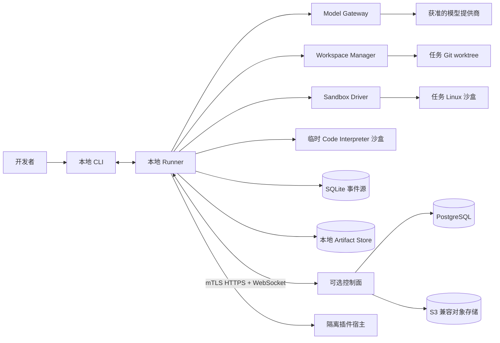

# SigmaCoder 生产级 Coding Agent 设计规格

> 状态：已确认的设计基线  
> 日期：2026-08-21  
> 需求来源：[`design_base.md`](./design_base.md)

## 1. 目的与规范语言

SigmaCoder 面向专业开发团队，提供“需求 → 分析/设计 → 本地实现 → 验证 → 独立审查 → 人工提升”的 Coding Agent Harness。产品采用本地优先的混合架构：源码、完整轨迹和真实执行默认留在开发者机器；可选控制面负责组织策略、身份、审批和审计。

本文中的“必须”“禁止”表示正确性或安全性要求；“应该”表示参考实现默认行为；“可以”表示可选扩展。任何实现若偏离“必须”或“禁止”，均不符合本设计。

### 1.1 规范来源

- `design_base.md` 是非规范的需求与方案候选来源，保留原文用于追溯，不直接约束实现。
- 本文是整合后的规范性设计；公共行为、状态、不变量和验收以本文为准。
- `docs/adr/` 记录难以逆转且存在真实取舍的已接受决策，用于解释本文为何如此设计，不是第二份并行规格。
- 新 ADR 若改变规范行为，必须在同一变更中同步更新本文与受影响测试；禁止长期保留互相冲突的“两个事实来源”。

### 1.2 成功标准

- 用户可以在 Git 仓库中创建可暂停、可恢复的 Coding Task，并获得隔离 worktree 中的已验证改动。
- 任何写入、命令、网络、凭据、审批、验证和提升行为均具有可追溯事件。
- 系统不得把“未运行”“结果未知”或“仅有既有失败”误报为正常验证通过。
- Agent 不得直接修改用户当前工作区、创建正式提交、推送分支或创建 PR。
- 崩溃后能够恢复业务状态并对未知副作用进行对账，但不承诺恢复活进程或任意 Shell 内存状态。
- 安全承诺必须能通过边界测试验证，不使用“绝对隔离”“100% 无缝恢复”等不可验证表述。

### 1.3 首版非目标

- IDE 插件、桌面 GUI 和自动 PR/推送。
- Windows 原生专属工具链；宿主支持 Windows、macOS、Linux，执行环境统一为 Linux 沙盒。
- 多个实现 Agent 并行写同一个 Task worktree。
- 依赖容器检查点恢复活进程。
- 首版微服务化、强制 microVM 或训练 Fast-Apply 模型。
- 保护已经失陷的宿主内核、本地 Runner 管理员或控制面管理员。

## 2. 架构与信任边界



### 2.1 部署单元

1. **本地 CLI/Runner**：Python 模块化单体，是 Task 执行、策略落实和本地数据的权威。
2. **可选控制面**：Python 模块化单体，负责组织身份、策略、集中审批、审计和允许同步的数据。
3. **任务沙盒**：每个 Task 独占的 Linux 执行边界；基准实现为 rootless OCI 容器。
4. **Code Interpreter 沙盒**：临时、无网络、无凭据，默认只读挂载项目内容，仅返回 Artifact。
5. **插件宿主**：第三方工具运行在独立进程或沙盒中，不与受信 Runner 共享内存权限。

### 2.2 信任假设

| 对象 | 默认信任 | 约束 |
|---|---:|---|
| 本地 Runner 与宿主内核 | 是 | 受文件权限、审计和升级签名保护 |
| 控制面 | 对组织数据可信 | 不自动获得源码和完整轨迹 |
| 目标仓库及其指令 | 否 | 仅作为带来源的上下文，不能授予权限 |
| 模型输出 | 否 | 所有动作必须经过类型、策略和状态校验 |
| 任务沙盒内进程 | 否 | 无宿主凭据、默认禁网、资源受限 |
| 第三方插件 | 否 | 隔离运行，权限按能力清单授予 |
| 模型提供商 | 按组织策略 | 只接收策略允许的数据，不接收密钥明文 |

### 2.3 核心不变量

1. 一个 Task 同时最多存在一个可写的实现 Run；Reviewer 和验证器只能读取绑定 revision 的不可变快照。
2. 每个物理副作用必须先通过策略判定，并以因果关联事件记录提议、决定和结果。
3. 每次编辑必须声明预期文件哈希；哈希不一致时禁止写入和自动合并。
4. `COMPLETED_VERIFIED` 只能引用最终 workspace revision 上完整通过的必需验证结果。
5. 未获得有效 Promotion Approval 时，禁止向用户原工作区写入任何 Task 改动。
6. 密钥明文禁止进入模型上下文、事件载荷、摘要和普通日志。
7. `OutcomeUnknown` 禁止被自动解释为成功，也禁止对非幂等动作盲目重试。
8. 控制面不可用时，本地低风险自动路径可以继续；需要集中审批或新策略的动作必须暂停。

## 3. 领域模型与生命周期

### 3.1 核心实体

| 实体 | 责任与边界 |
|---|---|
| `CodingTask` | 持久业务单元，拥有用户目标、基准提交、worktree、风险等级、预算、轨迹和最终结果 |
| `AgentRun` | Task 的一次连续执行尝试；暂停或恢复可以产生新 Run |
| `Turn` | 一次模型请求与响应，不等同于工具调用 |
| `WorkspaceRevision` | Task worktree 在一次成功写入后的不可变逻辑版本 |
| `TrajectoryEvent` | 按 Task 严格排序的事实记录，是状态投影的依据 |
| `DesignProposal` | 触发设计门时提交的人类可读且机器可校验的方案 Artifact |
| `VerifierRun` | 针对指定 revision、指定检查器和配置执行的验证 |
| `ReviewRun` | 在全新上下文中针对指定 revision 进行的独立审查 |
| `PromotionPackage` | 基准、目标哈希、diff、验证和审查证据的不可变集合 |
| `Artifact` | 不适合直接进入轨迹的大型或二进制结果，由哈希引用 |

### 3.2 Task 状态机

| 状态 | 进入条件 | 允许的下一状态 |
|---|---|---|
| `CREATED` | 接受合法任务请求 | `PREPARING`、`CANCELLED` |
| `PREPARING` | 校验 Git 仓库并准备 worktree、基线和所需执行环境 | `ANALYZING`、`NEEDS_ATTENTION` |
| `ANALYZING` | 在获准的只读能力内探索并确定风险和计划 | `WAITING_DESIGN_APPROVAL`、`IMPLEMENTING`、`PAUSED` |
| `WAITING_DESIGN_APPROVAL` | 中高风险或动态范围升级 | `IMPLEMENTING`、`ANALYZING`、`CANCELLED` |
| `IMPLEMENTING` | 获准的单写者 Run 修改 worktree | `VERIFYING`、`WAITING_DESIGN_APPROVAL`、`PAUSED`、`NEEDS_ATTENTION` |
| `VERIFYING` | 最终 revision 执行必需检查 | `REVIEWING`（策略要求审查）、`WAITING_PROMOTION_APPROVAL`（无需审查）、`WAITING_VERIFICATION_WAIVER`、`IMPLEMENTING` |
| `WAITING_VERIFICATION_WAIVER` | 必需检查不可完成 | `REVIEWING`（策略要求审查）、`WAITING_PROMOTION_APPROVAL`（无需审查）、`IMPLEMENTING`、`CANCELLED` |
| `REVIEWING` | 风险策略要求独立 Reviewer | `IMPLEMENTING`、`WAITING_PROMOTION_APPROVAL`、`NEEDS_ATTENTION` |
| `WAITING_PROMOTION_APPROVAL` | Promotion Package 已冻结 | `PROMOTING`、`COMPLETED`（仅保留包）、`IMPLEMENTING`、`CANCELLED` |
| `PROMOTING` | 已获有效一次性提升批准 | `COMPLETED`、`NEEDS_ATTENTION` |
| `PAUSED` | 用户、软预算、策略刷新或断连要求暂停 | 原阶段、`CANCELLED` |
| `NEEDS_ATTENTION` | 硬预算、熔断、恢复歧义或不可自动处理错误 | 原阶段、`CANCELLED`、`FAILED` |
| `COMPLETED` | 提升完成，或用户以绑定包哈希的签名决定仅保留包 | 终态 |
| `CANCELLED` | 用户取消且资源已安全收敛 | 终态 |
| `FAILED` | 不变量被破坏或无法安全恢复 | 终态 |

只读/no-exec Analyst 可以在没有执行沙盒时使用只读 `workspace`、`search` 和已验证的 `artifact` 并进入 `ANALYZING`。该配置禁止 `process`、`terminal`、`interpreter`、`edit`、网络、凭据和任何插件；执行型能力仍须等待符合 §8.1 的 SandboxDriver（实施 Ticket T05），不得把只读/no-exec 配置解释为安全沙盒或其替代品。

`COMPLETED` 还必须带结果枚举：`COMPLETED_VERIFIED` 或 `COMPLETED_WITH_EXCEPTIONS`。后者表示存在经过审计批准的验证豁免，界面不得使用普通“已验证”徽标。
LOW Task 或其他按策略不要求独立 Reviewer 的 Task，在验证门通过后直接冻结 Promotion Package 并进入 `WAITING_PROMOTION_APPROVAL`。用户选择“仅保留包”时必须追加绑定 `promotion_package_hash` 的 `PromotionPackageRetained` 事件并直接进入 `COMPLETED`，不得执行目标工作区写入，且结果明确记录 `promotion_applied=false`；这不是 Promotion Approval，也不能被展示为已提升。

### 3.3 动态范围升级

- 初始低风险任务一旦触及敏感路径、跨模块边界、依赖或迁移，或超出组织阈值，必须冻结后续变更工具。
- 参考默认低风险阈值为：单模块、最多 5 个文件、最多 150 行非生成代码变化，且不涉及删除、依赖、Schema、权限、网络或凭据。
- 系统追加 `ScopeEscalated` 事件，保留已发生的隔离 worktree 改动作为证据，但禁止提升。
- Agent 生成 `DesignProposal`；至少声明基准 revision、影响路径、模块关系、依赖变化、迁移、外部副作用、验证计划和回退方式。
- 机器校验只能依据项目明确声明的边界和策略判断合规性，不得宣称能够自动判断全部架构正确性。

## 4. 风险、策略与人工审批

### 4.1 Task 风险等级

| 等级 | 典型范围 | 强制门控 |
|---|---|---|
| `LOW` | 满足低风险阈值的单模块局部改动 | 确定性验证、最终提升审批 |
| `MEDIUM` | 超出低风险阈值、跨模块或修改依赖/构建配置 | 设计审批、独立 Reviewer、最终提升审批 |
| `HIGH` | 身份认证、计费、安全策略、迁移、CI/CD、基础设施、密钥或高影响数据路径 | 设计审批、独立 Reviewer、角色分离的人类复核、最终提升审批 |

路径和阈值来自组织与项目策略；LLM 的风险判断仅作建议，不能覆盖确定性策略结果。

### 4.2 动作风险等级

- **Green，自动执行**：允许范围内的读取、搜索、小范围创建或编辑、Git diff、已配置的 lint 和测试。
- **Yellow，显式审批**：文件删除、超范围批量修改、原始 Shell 高风险结构、长期后台进程、临时网络放行、短期能力令牌、宿主侧认证操作和 Promotion。
- **Red，拒绝且不可由普通任务审批覆盖**：访问允许根之外的宿主路径、特权容器、挂载容器管理 socket、读取其他 Task、导出宿主凭据、关闭审计或安全策略。

策略决定必须包含 `policy_version`、匹配规则、风险级别、所需审批者及解释。批准令牌必须绑定 Task、动作摘要、参数哈希、有效期和使用次数。

### 4.3 审批语义

- 设计、危险动作、验证豁免和提升是不同审批类型，禁止复用一个宽泛批准。
- 用户拒绝时追加 `ApprovalDenied`，保留拒绝理由并作为下一 Turn 的环境观测；禁止删除原 Turn。
- 修改动作参数、workspace revision 或策略版本后，原批准自动失效。
- 高风险任务必须满足组织定义的角色分离；实现者不能批准自己的高风险提升。

## 5. 上下文管理

### 5.1 项目指令

规范入口为 `AGENTS.md`，允许根目录和子目录作用域；`CLAUDE.md` 与 `.cursorrules` 通过兼容适配器读取并标注来源。优先级为：

1. 平台安全不变量。
2. 组织策略。
3. 已认证的用户任务约束与审批。
4. 目标文件最近目录的 `AGENTS.md`。
5. 根目录 `AGENTS.md`。
6. 兼容指令文件。

仓库指令不能授予权限。若用户任务要求穿越仓库明确禁区，系统必须产生冲突事件并请求显式审批，而不是静默选择一方。

### 5.2 `RuntimeStateSnapshot`

每轮模型调用都接收带来源、schema 版本和序列号的类型化状态快照，至少包含：

- Task、Run、阶段、风险等级和当前计划步骤。
- worktree 路径标识、基准提交、workspace revision、Git 变更摘要。
- 当前 CWD、命名终端状态和非敏感环境配置摘要。
- 待审批项、活跃/最近 `VerifierRun`、Reviewer 状态。
- 墙钟时间、Token/成本、工具调用、重规划和资源预算。
- 最近的进展信号、熔断计数及未解决的 `OutcomeUnknown`。

`RuntimeStateSnapshot` 必须由受信 Runner 根据权威状态投影确定性生成，模型只能读取，不能维护或回写。快照必须绑定 `task_version`、事件序列、workspace revision、策略版本和各来源投影哈希；在模型调用前以及任何变更工具执行前校验 schema、完整性与新鲜度。缺失、版本落后或投影不一致时，系统必须阻止变更动作、重建投影并记录 `RuntimeStateSnapshotInvalid`，禁止把疑似陈旧状态继续交给 Agent 决策。

`RuntimeStateSnapshot` 始终表示完整、确定性的权威对象，每次模型调用在语义上都必须接收并校验完整对象。传输优化必须使用独立的 `RuntimeStateDelta` 契约，至少包含 `base_snapshot_hash`、`target_snapshot_hash`、起止事件序列和类型化变更；接收方只有在本地基快照哈希精确匹配、重建出的完整快照通过 schema 且哈希等于 `target_snapshot_hash` 时才可使用。基快照缺失、哈希不符或增量链超过策略阈值时，必须丢弃增量并请求完整快照；完整快照恢复前不得发起模型调用或变更动作。增量本身不是权威状态，也不能作为工具前置条件。

模型适配器可以选择供应商支持的角色编码，但不得把完整快照或增量与普通用户文本拼接成无法区分的内容。

### 5.3 轨迹压缩

- 完整事件日志不可被摘要覆盖或删除。
- 活动上下文保留安全/组织约束、当前用户目标、获批设计、未解决风险、近期事件和可追溯摘要。
- 摘要必须记录来源事件区间、生成模型、模板版本和内容哈希；重要审批与安全决定必须保留原始结构化事件。
- Prompt Cache 仅是适配器优化，不能成为正确性、状态恢复或成本承诺的前提。

### 5.4 长输出

工具输出优先提取结构化诊断，同时提供默认头 50 行和尾 50 行预览。完整输出经脱敏后写入 Artifact Store；轨迹只保存摘要、内容哈希、大小、截断说明和 Artifact 引用。若解析器失败，必须标记 `diagnostic_extraction_failed`，仍返回机械截断预览。

## 6. 模型网关与角色

### 6.1 供应商中立接口

`ModelGateway` 通过能力协商描述流式输出、结构化输出、工具调用、上下文上限、缓存、速率限制和数据驻留。核心状态机不得依赖某一家供应商专有能力。

每次路由记录模型标识、适配器版本、参数摘要、所需能力、选择原因和数据策略。故障切换只允许选择满足能力、隐私和驻留规则的候选，并追加 `ModelFallback`；跨供应商或高风险切换可以要求审批，禁止静默切换。

### 6.2 `Model Eligibility Gate`

能力矩阵不是静态声明。每个 provider、model、version 与 adapter 组合都视为独立候选，只有通过 `Model Eligibility Gate` 后才能进入对应角色的路由池；新版本不得继承旧版本的准入结论。

准入证据至少包括：流式与工具调用契约、结构化输出和错误归一化、取消与用量计量、版本化任务回归集、隐私与数据驻留检查，以及组织规定的延迟/成本边界。结果必须绑定 Harness 版本、Prompt 模板、工具 schema 和评估数据集版本。

每个新候选通过离线检查后先进入 `EVALUATING`，只能处理合成、重放或无副作用的 shadow/canary 流量；其输出不得驱动工具调用、审查结论、审批决定或用户可见结果。只有达到版本化策略规定的最小样本数、正确性/能力/延迟阈值且没有 Critical 安全回归时，系统才能追加 `ModelEligibilityGranted` 并将其置为 `ELIGIBLE`。发现回归时必须追加 `ModelEligibilityRevoked` 并置为 `REVOKED`；fallback 也只能选择当前角色与策略下的 `ELIGIBLE` 候选。

### 6.3 角色隔离

- **Analyst**：只读探索、风险识别和 `DesignProposal`。
- **Implementer**：唯一可以请求 Task worktree 变更的角色。
- **Reviewer**：全新上下文，只读指定 revision，不得修改 worktree。
- **Summarizer**：生成可追溯摘要，不能改变事实状态。

角色名称本身不授予能力。Runner 必须将角色配置、动作风险、有效批准和沙盒挂载取交集，并按下表强制执行；任何越权尝试都返回 `RoleCapabilityDenied`、保持 worktree 哈希不变并追加审计事件。

| 角色 | 可调用能力 | worktree 与进程边界 | 审批权限 |
|---|---|---|---|
| Analyst | `workspace`、`search`、`artifact`；`process`/`interpreter` 仅限 `read_only_revision` 配置；只读插件 | 不可变 revision 只读挂载，可写临时目录与 worktree 分离；拒绝 `edit`、`terminal` 及任何声明写入/网络/凭据能力的插件 | 可提交 Design Approval 请求，不可申请动作放行 |
| Implementer | 按策略开放七类核心能力与获准插件 | 仅在持有 Task mutation lease 时读写活动 worktree；`process`、`terminal`、`interpreter` 和插件的整个进程树受同一租约、cgroup 与变更监测约束 | 可按风险策略申请限域动作批准 |
| Reviewer | `workspace`、`search`、`artifact`；`process`/`interpreter` 仅限 `read_only_revision` 配置；只读插件 | 指定 revision 只读挂载，构建输出仅进入会后销毁的临时层；拒绝 `edit`、`terminal` 和写入型插件 | 只能提交审查结论，不可批准自身审查或动作 |
| Summarizer | 仅可读取获授权的事件投影与 `artifact` | 不挂载 worktree；拒绝 `edit`、`process`、`terminal`、`interpreter` 和插件 | 无审批请求或决定权限 |

只读角色的 `process`、`interpreter` 或插件即使执行恶意代码，也只能写入隔离临时层；Runner 必须在系统调用与挂载边界阻止其修改 Task worktree。Implementer 工具返回时若仍有可能写 worktree 的后台进程，revision 必须标记为不稳定并禁止验证、审查和提升，直至进程树结束或被终止且变更被纳入新的 `WorkspaceRevision`。

这些名称首先表示权限和上下文隔离的工作流角色，不等于四个互相投票的 Agent。Analyst、Implementer 与 Summarizer 可以由不同调用承担，但它们不因“角色不同”而自动产生独立证据；Reviewer 是唯一承担独立判断职责的模型角色。只有能够引入独立观测、不同验证证据或明确隔离盲点时，才允许增加其他独立 Agent，禁止用重复意见制造虚假共识。

Reviewer 输入包括原始任务、获批设计、适用项目指令、diff、相关源码、验证证据和已知例外；禁止注入 Implementer 的私有推理或无关试错噪声。中高风险任务使用独立调用；组织可要求不同模型家族，无法满足时升级人工审查。

## 7. 核心工具与 ACI

### 7.1 七类固定核心能力

| 工具族 | 最小能力 |
|---|---|
| `workspace` | 列目录、Glob、按行读取，返回稳定行号和内容哈希 |
| `search` | 基于 ripgrep 的文本/正则搜索，结果有路径、行号和上限 |
| `edit` | 唯一匹配替换、结构化多文件补丁、暂存发布 |
| `process` | 显式 executable、argv、cwd、env delta、timeout 的非 Shell 执行 |
| `terminal` | Task 级命名 PTY，受控原始 Shell 与流式交互 |
| `interpreter` | 独立临时 Python 分析沙盒，默认只读项目 |
| `artifact` | 按范围、诊断或哈希读取完整工具结果 |

公共调用信封至少包含 `tool_call_id`、`task_id`、`run_id`、`workspace_revision`、`idempotency_key`、`deadline` 和类型化参数。结果至少包含状态、策略决定、开始/结束时间、revision 前后值、结构化诊断、摘要及 Artifact 引用。

结果状态统一为：`SUCCEEDED`、`FAILED`、`DENIED`、`CANCELLED`、`TIMED_OUT`、`OUTCOME_UNKNOWN`。命令非零退出属于正常完成的 `CommandFailed` 观测，不等同于 Runner 基础设施故障。

### 7.2 结构化进程与终端

- `process` 禁止接收拼接后的 Shell 字符串；程序和 argv 必须分离，cwd 与环境增量显式声明。
- 管道、重定向、变量展开和交互式程序进入 `terminal`，由策略解析风险并按需审批。
- 每个 Task 可以拥有策略限制数量的命名 PTY；单个 PTY 同时仅允许一个写者。
- 后台服务必须显式声明生命周期、端口、健康检查和清理策略；不得借助 Shell 隐式脱离看管。

### 7.3 确定性双通道编辑

1. **唯一匹配替换**：`old_text` 在目标文件中必须恰好匹配一次；0 次返回 `EditMatchNotFound`，多次返回 `EditMultipleMatches` 及有限行号快照。
2. **结构化补丁**：支持一个事务内的多文件、多区块变更，不使用额外合并模型。
3. 两个通道都必须携带每个目标文件的预期 SHA-256；不一致返回 `EditPreconditionFailed(content_hash_mismatch)`、当前哈希和最小外部差异引用。
4. 哈希不一致时禁止物理写入、自动三路合并或生成冲突标记；Agent 必须重读后重新规划。

多文件改动使用暂存发布协议：

- `PREPARED`：持久化目标列表、原始内容引用、目标内容引用和事务日志。
- `STAGED`：在隔离视图完整应用所有改动并运行可用的快速语法检查。
- `APPLYING`：串行写回 Task worktree，单文件使用同文件系统临时文件与原子重命名。
- `COMMITTED`：全部文件写回且目录元数据持久化后产生新 `WorkspaceRevision`。
- `RECOVERY_REQUIRED`：崩溃或磁盘错误导致结果不确定；禁止继续写，先依据日志幂等前滚或回滚。

该协议不宣称操作系统提供跨文件原子事务；它保证部分发布可检测、可恢复，并在恢复前阻止后续变更。

### 7.4 插件协议

扩展通过独立进程/沙盒中的版本化 JSON-RPC 接入，能力清单必须声明：工具 schema、所需文件/网络/凭据能力、风险等级、幂等性、取消、超时、输出上限和审计字段。最小方法为 `initialize`、`capabilities.list`、`tools.call`、`tools.cancel` 和 `health`。

MCP 通过适配器映射到同一能力清单；MCP 元数据不足时默认采用更高风险等级。任何插件都不能绕过 Runner 的策略、审批、脱敏和 Artifact 管道。

## 8. 沙盒、网络与凭据

### 8.1 `SandboxDriver`

核心接口至少支持创建、启动、结构化执行、终端连接、只读快照、状态检查、停止和销毁。基准 OCI 实现必须：

- 使用非特权用户、rootless 模式、只读基础文件系统和最小 Linux capabilities。
- 禁止宿主 PID/网络/用户命名空间、容器管理 socket 和未声明设备。
- 仅将 Task worktree 挂载到明确路径；其他宿主路径不可见。
- 配置 CPU、内存、PIDs、磁盘和墙钟预算，并终止完整进程树。
- 每个 Task 使用独立沙盒与网络策略；不得跨 Task 共享可写卷。

高安全部署可以提供 microVM Driver，但不能改变 Task、工具、事件或审批语义。

### 8.2 网络

沙盒默认拒绝出站网络。组织/项目策略按域名、协议、端口和用途建立白名单；DNS 解析结果还必须阻断环回、私网、链路本地和云元数据地址。临时放行是 Yellow 动作，绑定 Task、目标、时限和审批，所有连接写入审计。

模型 API 调用发生在沙盒外的 Model Gateway，不等于给沙盒开放网络。控制面断连不改变已经缓存且仍有效的本地白名单，但新放行请求必须暂停。

### 8.3 凭据

- 沙盒默认不继承宿主环境变量、SSH agent、云凭据或配置目录。
- 认证操作优先由沙盒外的受信高层工具代理执行，并只返回脱敏结果。
- 确需沙盒使用时，短期能力令牌必须经审批，绑定 Task、具体操作、目标、最小权限和有效期；只注入到目标子进程，完成后立即撤销。
- 脱敏采用已知秘密指纹、供应商格式检测和结构化字段策略；正则只是纵深防御，不能作为秘密不泄露的唯一保证。
- 原始秘密值不得写入事件、Artifact 元数据、Prompt、摘要或错误信息。

## 9. 验证与独立审查

### 9.1 相对基线零回归

Runner 在实现前记录项目配置的 lint、类型检查和测试基线，并按规范化检查项 ID 比较结果。最终 revision 必须满足：

- 不新增失败、错误或未获准的跳过项。
- 与改动相关的检查项必须通过。
- 中高风险任务运行组织策略要求的更大范围或全量检查。
- 既有失败必须在最终报告中逐项披露，不能以总退出码掩盖。
- flaky 只可来自既有基线、项目登记或按策略重复运行的证据，Agent 不能自行把失败标为 flaky。

若行为改动没有可运行测试或必需环境缺失，状态为 `VerificationIncomplete`。授权用户可以提交带理由、范围和期限的一次性豁免；结果只能是 `COMPLETED_WITH_EXCEPTIONS`。

### 9.2 两级即时验证

1. **暂存语法门**：在完整 staged view 上使用可插拔 `SyntaxChecker` 做快速解析。无可靠解析器时记录 `syntax_check_unavailable`；不能假装通过。失败则不写回 worktree。
2. **写回后验证**：快速 lint/类型检查形成下一次写入前的屏障；长测试在不可变 workspace snapshot 上并行运行，结果绑定 revision。

旧 revision 的通过结果不得直接判定当前 revision 通过。进入 Reviewer 或 Promotion 前，最终 revision 的所有必需 `VerifierRun` 必须完成或获得明确豁免。

### 9.3 Reviewer

- LOW Task 默认只要求确定性验证；策略可以提升为独立审查。
- MEDIUM/HIGH Task 必须启动全新上下文 Reviewer。
- Reviewer 发现 Blocker/Major 问题时回到 `IMPLEMENTING`；每次回退消耗重规划预算。
- HIGH Task 在 Reviewer 通过后仍需满足角色分离的人类复核。
- Reviewer 不得直接修改 worktree，也不得把“LGTM”替代确定性验证或 Promotion Approval。

## 10. 事件、持久化与恢复

### 10.1 本地事件源

SQLite/WAL 的只增事件表是 Task 轨迹权威；状态表、搜索索引和运行看板都是可重建投影。事件信封至少包含：

```text
event_id, task_id, sequence, event_type, schema_version,
occurred_at, actor, correlation_id, causation_id,
workspace_revision, sensitivity, payload, previous_hash, event_hash
```

同一 Task 的 `sequence` 必须连续且唯一。已提交事件禁止更新或删除；schema 通过向前兼容版本演进。JSONL 只用于版本化导入、导出和人工审计，不是运行时权威源。

关键事件至少包括：Task/Run/Turn 生命周期、模型选择与降级、工具提议与结果、策略决定、审批、设计、workspace revision、验证、审查、预算、无进展、看门狗、恢复和 Promotion。

系统不要求也不保存模型不可见的隐藏推理；轨迹只包含实际发送/接收内容、结构化决定和工具事实。

### 10.2 Artifact Store

完整日志、大 diff、快照、设计、审查报告和 Promotion Package 存入内容寻址 Artifact Store。元数据包含内容哈希、类型、大小、创建事件、敏感级别、脱敏状态、加密密钥标识和保留策略。

参考默认值为：Task Artifact 完成后保留 30 天、本地 Task 事件保留 90 天、控制面审计保留 365 天；组织可以延长、缩短或设置法律保全。清理必须产生审计事件，仍被活动 Task、审批或保全引用的内容禁止删除。

### 10.3 恢复

恢复流程必须按顺序：

1. 校验事件序列和哈希链，重建最新投影与检查点。
2. 完成任何 `RECOVERY_REQUIRED` 编辑事务的幂等前滚或回滚。
3. 校验 worktree 与记录 revision；不一致时进入 `NEEDS_ATTENTION`。
4. 重新创建沙盒和命名终端，恢复声明式 CWD、非敏感环境与初始化步骤。
5. 对没有终态事件的工具追加 `OutcomeUnknown` 并对账。

只读或明确幂等的调用可以使用原 idempotency key 查询或重试；外部副作用无法确认时必须人工处理。活进程、内存、任意 Shell 局部状态和网络事务不在恢复承诺内。

#### 10.3.1 `Reconciliation` 对账契约

对账由受信 Runner 中的确定性 `Reconciler` adapter 执行，不由模型生成结论。每个可能产生外部副作用的工具必须声明权威查询来源、`invocation_id`/idempotency key、可核验外部标识及是否支持对账；没有可靠查询来源时必须显式声明 `reconciliation_unsupported`。

对账结果只能是 `CONFIRMED_SUCCEEDED`、`CONFIRMED_FAILED` 或 `STILL_UNKNOWN`，并附带权威来源、查询时间、证据摘要和 Artifact 引用。模型可以请求对账并读取结果，但不能构造、修改或覆盖权威结论；`STILL_UNKNOWN` 或不支持对账时，Task 进入 `NEEDS_ATTENTION`。对账查询本身仍经过策略、凭据代理、超时和审计，但必须保持只读；除非外部系统契约明确保证，否则“未查到记录”不能被自动解释为执行失败。

### 10.4 无进展熔断与看门狗

进展信号包括新代码事实、workspace revision、验证改善、计划步骤推进、审批变化或可验证的外部状态变化。仅当相同/等价调用与观测重复且没有进展信号时，才累计 `NoProgress`。

参考默认策略：连续 3 次等价无进展观测触发软中断和强制重新规划；两次重新规划后仍无进展则 `CircuitBreakerTripped` 并进入 `NEEDS_ATTENTION`。基础设施故障最多自动重试 3 次并指数退避；命令失败、验证失败和策略拒绝不计为基础设施故障。

看门狗为每个工具配置软无活动时限、硬总时限和终止宽限期。无 stdout/stderr 只是信号之一；软时限先采集进程树、CPU、内存和最近输出，硬时限才先终止、后强杀整个进程树并保存诊断 Artifact。

## 11. 本地与控制面数据边界

### 11.1 分域权威

- Runner 权威：Task 轨迹、worktree revision、完整 Artifact、工具与验证事实。
- 控制面权威：组织身份、有效策略、集中审批决定和集中审计。
- 默认同步：脱敏状态、计数、延迟、错误分类、审批和审计事件。
- 默认不同步：源码、diff、Prompt、完整工具输出和完整轨迹。

内容级同步必须由组织策略明确允许并在本地界面可见。控制面对象存储只接收获准、加密的 Artifact。

### 11.2 通信

Runner 主动建立 mTLS 出站连接，不开放本地入站端口。HTTPS 承载请求/响应，WebSocket 承载审批、策略刷新和实时事件；所有消息带 schema 版本、游标、消息 ID 和幂等键。

最小控制面 API：

- `POST /v1/runner-sessions`：建立 Runner 会话并协商能力。
- `GET /v1/effective-policy`：获取带版本和签名的有效策略。
- `POST /v1/event-batches`：按游标幂等同步允许的事件。
- `POST /v1/approval-requests`：登记审批请求。
- `POST /v1/approvals/{id}/decisions`：返回签名决定。
- `POST /v1/artifact-uploads`：初始化策略允许的加密 Artifact 上传。
- `GET /v1/runner-stream`：建立带游标恢复的 WebSocket 通道。

断线重连按最后确认游标补传。策略过期时，已执行中的 Green 动作可以按缓存策略完成；新 Yellow/Red 判断、集中审批和内容同步必须暂停。

## 12. Promotion Package

Promotion Package 是不可变 Artifact，至少包含：

- Task ID、基准提交、最终 workspace revision 和包哈希。
- 每个目标文件的基准/预期哈希、创建/修改/删除类型和完整 diff 引用。
- 适用 `DesignProposal`、风险等级和策略版本。
- 最终 revision 的验证结果、既有失败、flaky 证据和任何豁免。
- Reviewer 结论、人类复核和未解决风险。
- 应用前检查与失败恢复说明。

用户审批后，Runner 对原工作区执行 dry-run。目标文件或基准不一致时返回 `PromotionPreconditionFailed`，禁止自动三路合并；无关文件的本地改动可以保留，只要不影响目标前置条件。应用使用与 Task 编辑相同的暂存发布和恢复日志，不创建正式提交。

## 13. CLI 与参考技术栈

### 13.1 CLI 能力

参考命令面：

- `sigma task start`：从需求创建 Task。
- `sigma task list|status|attach`：查看并连接运行。
- `sigma task pause|resume|cancel`：控制生命周期。
- `sigma approval show|approve|deny`：处理带范围的审批。
- `sigma diff`：查看指定 revision 或 Promotion Package。
- `sigma verify`：查看/重跑允许的 Verifier。
- `sigma artifact read`：按范围读取 Artifact。
- `sigma promote`：dry-run、审批并应用 Promotion Package。
- `sigma policy explain`：解释动作的有效策略和风险结果。

所有命令同时提供机器可读 JSON 输出；交互模式使用流式终端展示，但不得隐藏状态、审批范围或验证例外。

### 13.2 Python 参考实现

- 使用仍受安全支持的稳定 CPython 3.x，并在实施开始时锁定确切小版本和依赖哈希。
- `asyncio` 负责并发与取消；类型化 schema 使用 Pydantic 风格模型。
- CLI 参考 Typer/Rich；控制面参考 FastAPI；数据库访问参考 SQLAlchemy/Alembic 与 psycopg。
- 本地 SQLite 使用 WAL 和显式事务；控制面使用 PostgreSQL；Artifact 使用本地内容寻址目录和 S3 兼容对象存储。
- OCI 基准 Driver 对接 rootless Docker 或 Podman API；Linux 容器内 PTY 由标准 PTY 能力承载。
- 插件使用独立进程 JSON-RPC；MCP 只作为适配层。

库名是参考选择，不属于跨实现规范。实施前必须依据官方兼容矩阵锁定版本；替换库不得改变本文的不变量和公共契约。

## 14. 预算、遥测与质量指标

### 14.1 预算

每个 Task 同时限制 Token/费用、墙钟时间、工具调用、重规划次数、CPU、内存、PIDs 和磁盘。提供 Quick、Balanced、Deep 三种组织可配置模板，默认 Balanced。软阈值触发摘要和重新规划；硬阈值进入 `PAUSED` 或 `NEEDS_ATTENTION`，只有授权用户可以扩容，禁止静默超支。

### 14.2 遥测

本地保存内容级明细；控制面默认只接收脱敏计数、阶段耗时、模型用量、工具/错误分类、验证状态、审批和审计。指标必须区分模型延迟、工具执行时间和 Harness 自身开销。

首批 Harness 指标：Task 完成率、人工返工率、验证回退次数、Reviewer 有效发现率、审批等待时间、无进展误报率、恢复成功率、每 Task Token/成本、上下文压缩率、沙盒启动耗时、`RuntimeStateSnapshot` 一致性失败/陈旧拦截次数，以及各模型版本的准入、撤销和回归趋势。

### 14.3 初始性能目标

在参考硬件与预热环境中，Harness 自身的初始目标为：本地策略判断 p95 不超过 50 ms、事件提交确认 p95 不超过 50 ms、不含代码检索的状态快照组装 p95 不超过 200 ms、预热 OCI 沙盒创建 p95 不超过 10 秒。模型与项目测试耗时单独报告，不混入 Harness 指标。

这些是实施验收目标，不是跨硬件保证；若基准不满足，必须记录测量环境并通过 ADR 调整，而不是静默放宽。

状态快照同时具有正确性 SLO：任何已知陈旧或不一致快照到达变更执行点的目标值为零；检测到不一致并安全阻断属于正确行为，不得为了降低错误计数而忽略或降级校验。

## 15. 测试与验收

### 15.1 单元与属性测试

- 指令优先级、目录作用域、冲突审批和不可信来源标记。
- 风险规则、批准令牌绑定、过期、一次性消费和拒绝事件。
- 事件顺序、schema 演进、投影重建、摘要来源引用和 Artifact 哈希。
- 唯一替换的 0/1/多匹配、哈希前置条件、编码/换行和路径规范化。
- 输出诊断提取、头尾各 50 行、脱敏及 Artifact 回读。
- 模型能力路由、显式 fallback 和数据策略过滤。
- 相同权威投影必然生成相同完整 `RuntimeStateSnapshot`；`RuntimeStateDelta` 重建结果必须逐字节等于目标完整快照，基哈希错误、目标哈希错误、版本落后或 schema 缺失均阻止模型调用与变更工具。
- 新模型版本不会继承旧版本准入；契约、回归、隐私或驻留检查失败时不进入路由池，未满足 shadow/canary 退出条件时保持 `EVALUATING`。
- Task 状态机覆盖“需要 Reviewer”“不需要 Reviewer”“验证豁免”及“仅保留包”分支；每条非终态路径都有确定的下一状态，且 `PromotionPackageRetained` 不触发目标工作区写入。

### 15.2 集成与故障注入

- PTY 的 CWD/环境跨 Turn 保持、单写者互斥、暂停与重建。
- 多文件发布在每个日志阶段崩溃、磁盘满或进程被杀后的恢复。
- SQLite WAL 崩溃、损坏尾部、重复事件批次和控制面游标重放。
- in-flight 幂等/非幂等工具分别进入重试、对账或人工处理。
- Analyst、Reviewer 与 Summarizer 分别通过 `edit`、`process`、`terminal` 和插件尝试写入均被 Runner 拒绝，产生 `RoleCapabilityDenied` 且 worktree 哈希不变；Implementer 后台进程不得绕过 mutation lease。
- `Reconciler` 只能依据权威只读来源产生三态结果；模型伪造结果、查询无记录和持续未知均不得被当作成功或失败。
- 快速验证写屏障、长测试 revision 绑定、旧结果失效和验证豁免。
- 合法轮询不会被误判为无进展；真实重复循环先重规划、后熔断。
- 静默但健康的构建只触发诊断，越过硬时限才终止完整进程树。
- Promotion 目标漂移、无关脏文件、应用中断和恢复。

### 15.3 对抗安全测试

- `../`、绝对路径、符号链接、硬链接和挂载点逃逸。
- 容器特权提升、宿主 namespace、容器 socket、设备和跨 Task 卷访问。
- Shell 嵌套、变量展开、`eval`、子脚本和后台进程绕过策略。
- DNS 重绑定、私网/元数据地址、白名单域名跳转和数据外传。
- README/测试输出中的提示注入诱导读取密钥、放宽网络或修改策略。
- 临时令牌只能访问绑定目标，过期/撤销后失效，明文不进入模型与轨迹。
- 恶意插件无法绕过能力清单、调用未授权核心工具或污染 Runner 内存。

### 15.4 端到端验收场景

1. 低风险单文件修复无需设计门，完成相关验证、生成包并经用户批准提升。
2. 初始低风险任务触及敏感路径后冻结写入，提交可机检设计，拒绝原因进入下一 Turn。
3. 存在既有失败的仓库完成改动后无新增失败，报告明确展示基线问题。
4. 长测试针对旧 revision 失败时不得污染新 revision 的结论，最终版本重新验证。
5. Runner 在编辑发布和外部工具调用中分别崩溃，恢复后不重复未知副作用。
6. 中风险任务由 fresh-context Reviewer 发现 Major 问题，回到实现并在预算内纠正。
7. 控制面断线时 Green 路径继续，临时联网或高风险审批暂停；重连后幂等补传。
8. 原工作区目标文件变化导致 Promotion 被拒绝，不产生自动合并或部分写入。
9. 模型新候选通过离线检查后仅进入无副作用 shadow/canary；达到最小样本与全部阈值后才进入生产路由，准入回归时自动撤销且不再被选择。

验收的硬门槛是：无未审批的受控副作用、无被误报的验证成功、无已提交事件丢失、无目标哈希不一致时的写入，以及所有恢复歧义均显式进入可见状态。

## 16. 实施顺序

1. **本地可信核心**：Task/Run 状态机、SQLite 事件源、Git worktree、核心文件/搜索/编辑工具和 CLI。
2. **执行与验证**：OCI Driver、结构化 process、命名 PTY、两级验证、Artifact Store、预算/熔断/恢复。
3. **治理闭环**：风险策略、设计门、Reviewer、Promotion Package、凭据代理和安全测试。
4. **可选控制面**：身份、策略、审批、审计、mTLS 同步、PostgreSQL/S3。
5. **生态扩展**：隔离 JSON-RPC 插件、MCP 适配、多模型能力路由和评估基准。

`design_base.md` 提到的 `ch5/coding-agent`、OpenClaw 与 Self-Harness 实验当前不在本工作区，因此不是本设计的构建依赖；若未来引入，只能作为基准与验证素材，不能替代本文契约。
